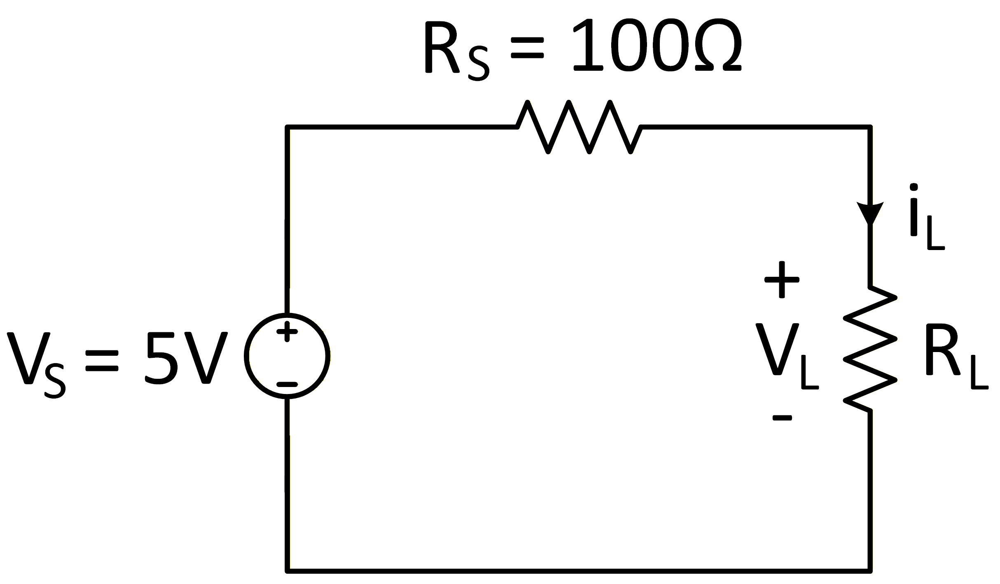
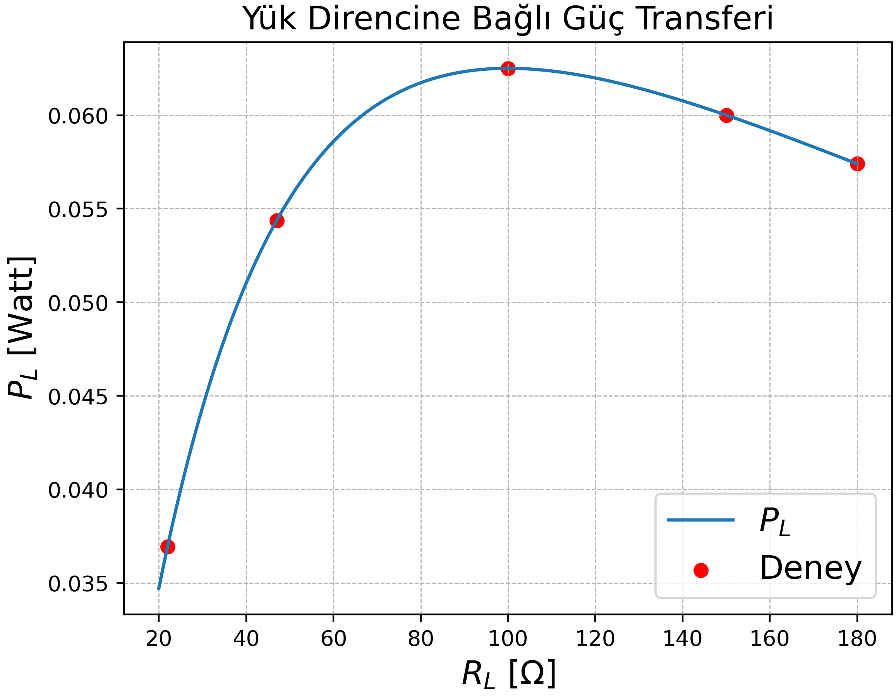

### Maksimum Güç Transferi



Bu devrede güç kaynağının iç direnci gerçekte çok küçük olduğundan ihmal edilmiştir. Bunun yerine, deneysel çalışmada kaynak direncini temsil etmesi amacıyla hârici olarak  
$R_S = 100\Omega$’luk bir direnç kullanılmıştır. Deneyde yük direnci $R_L$ için sırasıyla  
$[22,47,100,150,180]\Omega$ değerleri seçilerek güç ölçümleri yapılmıştır.

Bu bölümde önce maksimum güç transferi için teorik olarak gerekli yük direnci $R_L$ değeri bulunacak, ardından sonuçlar Python kullanılarak sayısal olarak hesaplanıp grafiksel olarak gösterilecektir.

---

#### Matematiksel Çözüm

Matematik ve mühendislikte bir niceliğin maksimum veya minimum değerini bulmaya çalışmak bir **optimizasyon problemi**dir. Yapay sinir ağları dâhil olmak üzere birçok modern mühendislik yönteminin temelinde de türev alma (gradyan) temelli optimizasyon yaklaşımları yer almaktadır.

Burada yük direnci üzerinde harcanan gücü ifade eden fonksiyon elde edilip, bu fonksiyonun yük direncine göre türevi alınarak sıfıra eşitlenecektir. Öncelikle yük direnci üzerindeki gücü tanımlayalım:

$$
V_L = i_L R_L
$$

$$
i_L = \frac{V_L}{R_L}
$$

$$
P_L = V_L i_L = V_L \frac{V_L}{R_L} = \frac{V_L^2}{R_L}
$$

Yük direnci üzerindeki gerilim $V_L$, gerilim bölücü (voltage divider) prensibi kullanılarak

$$
V_L = \frac{R_L}{R_S + R_L} V_S
$$

şeklinde ifade edilir. Bu ifade güç denkleminde yerine konulduğunda, $V_S$ ve $R_S$’nin sabit olduğu ve yük direnci üzerindeki gücün yalnızca $R_L$’ye bağlı olduğu görülür:

$$
P_L(R_L) = \frac{R_L^2 V_S^2}{(R_S + R_L)^2} \cdot \frac{1}{R_L}
= \frac{R_L V_S^2}{(R_S + R_L)^2}
$$

Maksimum güç transferi için bu fonksiyonun $R_L$’ye göre türevi alınarak sıfıra eşitlenmelidir:

$$
\frac{\partial P_L}{\partial R_L}
= \frac{V_S^2 (R_S + R_L)^2 - 2 R_L V_S^2 (R_S + R_L)}{(R_S + R_L)^4}
$$

$$
= \frac{V_S^2 (R_S - R_L)}{(R_S + R_L)^3} = 0
$$

Buradan

$$
R_L = R_S = 100\Omega
$$

sonucu elde edilir. Yani maksimum güç transferi, yük direncinin kaynak direncine eşit olduğu durumda gerçekleşir.

---

#### Nümerik Çözüm

Aşağıda verilen Python kodu kullanılarak yük direncine bağlı güç değişimi sayısal olarak hesaplanmış ve grafik üzerinde gösterilmiştir. Grafikten de görüldüğü üzere, güç maksimum değerine $R_L = 100\,\Omega$ değerinde ulaşmaktadır.

```python
import numpy as np
import matplotlib.pyplot as plt

# Elektrik devresi parametreleri
Vs = 5      # Volt
Rs = 100    # Ohm
T = 1        # RL artış miktarı
RL_min, RL_max = 20, 180

RL = np.arange(RL_min, RL_max + T, T)
PL = (Vs**2) * RL / ((Rs + RL)**2)

RL_deney = np.array([22, 47, 100, 150, 180])
PL_deney = (Vs**2) * RL_deney / ((Rs + RL_deney)**2)

# Grafik
plt.plot(RL, PL, label=r"$P_L$")
plt.scatter(RL_deney, PL_deney, label="Deney", color="red")
plt.xlabel(r"$R_L$ [$\Omega$]", fontsize=15)
plt.ylabel(r"$P_L$ [Watt]", fontsize=15)
plt.title("Yük Direncine Bağlı Güç Transferi", fontsize=15)
plt.legend(fontsize=15)
plt.grid(True, which='both', linestyle='--', linewidth=0.5)
plt.savefig("maksimum_guc_transferi.png", dpi=500)
plt.show()
```

